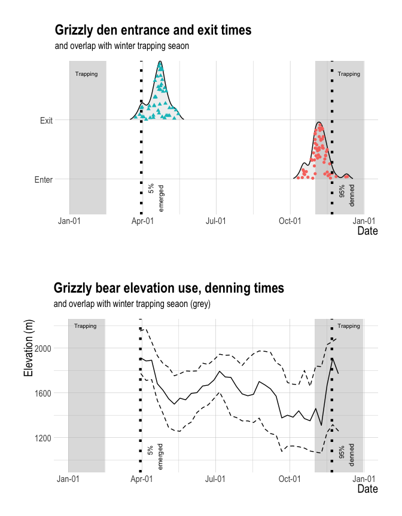
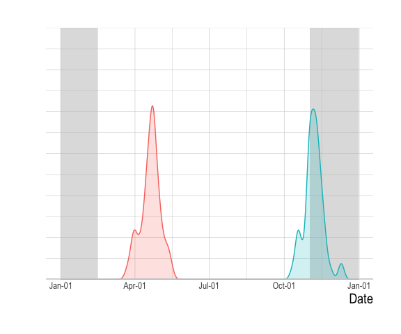
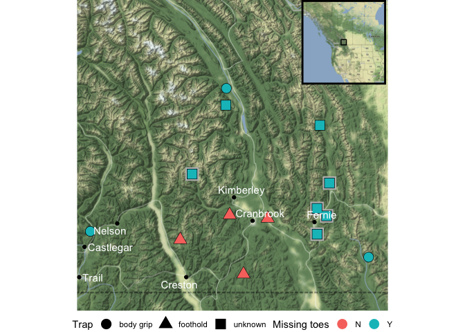

Missing Toes
================
Clayton Lamb
22 October, 2021

## Load Packages

``` r
library(here)
library(raster)
library(sf)
library(ggmap)
library(mapview)
library(rgdal)
library(hrbrthemes)
library(RColorBrewer)
library(tidyverse)
library(lubridate)
library(velox)
library(tidylog)
library(scales)
library(ggridges)
library(ggpubr)
library(maps)
library(ggsflabel)
library(ggrepel)
library(knitr)
options(scipen=999)
```

## Load data

``` r
##capture records
cap <- read_csv(here::here("data_git","cap.csv"))
##den records
den <- read_csv(here::here("data_git","den.csv"))
##bear ele use
ele.summary <- read_csv(here::here("data_git","ele.csv"))
##observations
toelocs <- read_csv(here::here("data_git","toelocs.csv"))%>%
  st_as_sf(coords=c("X","Y"), crs=4326)%>%
  rename("Missing toes"=missing, Trap=trap)
```

## Denning summary

``` r
##make all the same year for easy calculation
den$enter.yr <- den$enter
year(den$enter.yr) <- 2020

den$exit.yr <- den$exit
year(den$exit.yr) <- 2020

##summarise
den%>%
 summarise(med.enter=median(enter.yr,na.rm=TRUE),
           upper75=quantile(enter.yr,na.rm=TRUE,0.75, type = 1),
           upper95=quantile(enter.yr,na.rm=TRUE,0.95, type = 1),
           med.exit=median(exit.yr,na.rm=TRUE))%>%
  kable()
```

    ## summarise: now one row and 4 columns, ungrouped

| med.enter  | upper75    | upper95    | med.exit   |
| :--------- | :--------- | :--------- | :--------- |
| 2020-11-06 | 2020-11-12 | 2020-11-22 | 2020-04-21 |

``` r
den.enter <- den%>%
 summarise(median=median(enter.yr,na.rm=TRUE),
           upper75=quantile(enter.yr,na.rm=TRUE,0.75, type = 1),
           upper95=quantile(enter.yr,na.rm=TRUE,0.95, type = 1))%>%
  mutate(x="enter")%>%
  pivot_longer(-x)
```

    ## summarise: now one row and 3 columns, ungrouped

    ## pivot_longer: reorganized (median, upper75, upper95) into (name, value) [was 1x4, now 3x3]

``` r
den.exit <- den%>%
 summarise(median=median(exit.yr,na.rm=TRUE),
           lower25=quantile(exit.yr,na.rm=TRUE,0.25, type = 1),
           lower5=quantile(exit.yr,na.rm=TRUE,0.05, type = 1))%>%
  mutate(x="exit")%>%
  pivot_longer(-x)
```

    ## summarise: now one row and 3 columns, ungrouped

    ## pivot_longer: reorganized (median, lower25, lower5) into (name, value) [was 1x4, now 3x3]

``` r
den.95 <- tibble(class=c("95% \n denned","5% \n emerged"),
                 date=c(ymd("2020-11-22"),ymd("2020-03-30")))
```

## Plot

``` r
a <- ggplot(ele.summary, aes(x=date,y=elev))+
  annotate("rect", xmin=ymd("2020-11-01"), xmax=ymd("2020-12-31"), ymin=-Inf, ymax=Inf, alpha=0.5, fill="grey")+
  annotate("rect", xmin=ymd("2020-01-01"), xmax=ymd("2020-02-15"), ymin=-Inf, ymax=Inf, alpha=0.5, fill="grey")+
  annotate("text", x=ymd("2020-01-22"), y=2200,label="Trapping", size=2.5)+
  annotate("text", x=ymd("2020-12-13"), y=2200,label="Trapping", size=2.5)+
  geom_line()+
  geom_ribbon(aes(ymin=lwr,ymax=upr),alpha=0.1,linetype="dashed", color="black", fill=NA)+
  theme_ipsum()+
  labs(x="Date",y="Elevation (m)", title="Grizzly bear elevation use, denning times ", subtitle="and overlap with winter trapping seaon (grey)")+
  theme(axis.title.x = element_text(size=15),
        axis.title.y = element_text(size=15),
        axis.text = element_text(size=10),
        legend.text = element_text(size=13),
        legend.title=element_text(size=15))+
 geom_vline(data=den.95, aes(xintercept=date), linetype="dotted",  size=1.5)+
 geom_text(data=den.95, aes(x=date, y=1150, label=class), size=3, angle=90, vjust=1.5, hjust=1) +
    ylim(950,2200)+
    scale_x_date(labels = date_format("%b-%d"),limits = c(ymd("2020-01-01"),ymd("2020-12-31")))
  
  b <- ggplot(den%>%select(BearID,Enter=enter.yr,Exit=exit.yr)%>%pivot_longer(-BearID), aes(x=value,y=name))+
  annotate("rect", xmin=ymd("2020-11-01"), xmax=ymd("2020-12-31"), ymin=-Inf, ymax=Inf, alpha=0.5, fill="grey")+
  annotate("rect", xmin=ymd("2020-01-01"), xmax=ymd("2020-02-15"), ymin=-Inf, ymax=Inf, alpha=0.5, fill="grey")+
  annotate("text", x=ymd("2020-01-22"), y="Exit", label="Trapping", size=2.5, vjust=-11)+
  annotate("text", x=ymd("2020-12-13"), y="Exit", label="Trapping", size=2.5, vjust=-11)+
  geom_density_ridges(scale = 1,rel_min_height = 0.01, aes(point_color = name, point_fill = name, point_shape = name),
    alpha = .2, point_alpha = 1, jittered_points = TRUE)+
  theme_ipsum()+
  labs(x="Date",y="", title="Grizzly den entrance and exit times", subtitle="and overlap with winter trapping seaon")+
  theme(axis.title.x = element_text(size=15),
        axis.title.y = element_text(size=15),
        axis.text = element_text(size=10),
        legend.text = element_text(size=13),
        legend.title=element_text(size=15))+
 geom_vline(data=den.95, aes(xintercept=date), linetype="dotted",  size=1.5)+
 geom_text(data=den.95, aes(x=date, y="Enter", label=class), size=3, angle=90, vjust=1.5, hjust=1.2) +
    scale_x_date(labels = date_format("%b-%d"),limits = c(ymd("2020-01-01"),ymd("2020-12-31")))+
    theme(legend.position = "none")
  

ggarrange(b,a, ncol=1)
```

<!-- -->

``` r
ggsave(here::here("plots","timing.png"), width=7, height=9)
```

## Main Plot (details added in .ppt)

``` r
ggplot(den%>%select(BearID,Enter=enter.yr,Exit=exit.yr)%>%pivot_longer(-BearID)%>%drop_na())+
  annotate("rect", xmin=ymd("2020-11-01"), xmax=ymd("2020-12-31"), ymin=-Inf, ymax=Inf, alpha=0.5, fill="grey")+
  annotate("rect", xmin=ymd("2020-01-01"), xmax=ymd("2020-02-15"), ymin=-Inf, ymax=Inf, alpha=0.5, fill="grey")+
        geom_density( aes(x=value, color = fct_reorder(name, value), fill = fct_reorder(name, value)),
    alpha = .2)+
  theme_ipsum()+
  labs(x="Date",y="", fill="Den", color="Den")+
  theme(axis.title.x = element_text(size=15),
        axis.title.y = element_text(size=15),
        axis.text.y = element_blank(),
        axis.text.x = element_text(size=10),
        legend.text = element_text(size=13),
        legend.title=element_text(size=15))+
    scale_x_date(labels = date_format("%b-%d"),limits = c(ymd("2020-01-01"),ymd("2020-12-31")))+
#geom_vline(data=den.95, aes(xintercept=date), linetype="dashed",  size=0.5)+
    theme(legend.position = "none")+
  scale_y_continuous(expand = c(0, 0), limits = c(0, 0.06))+
  geom_hline(yintercept=0, colour="grey80", size=1)
```

<!-- -->

``` r
ggsave(here::here("plots","timing2.png"), width=8, height=6)
```

## Map

``` r
# register_google("add your key here")
# basemap <- ggmap::get_map(location = c(lat = 50, lon =-116),zoom=8, maptype ="terrain", source="stamen")
# basemap2 <- ggmap::get_map(location = c(lat = 50, lon =-116),zoom=4, maptype ="terrain", source="stamen")
# saveRDS(basemap,file=here::here("data_git","basemap.rds"))
# saveRDS(basemap2,file=here::here("data_git","basemap2.rds"))
basemap <- readRDS(here::here("data_git","basemap.rds"))
basemap2 <- readRDS(here::here("data_git","basemap2.rds"))
#bb2bbox(attr(basemap, "bb"))

data(world.cities)
cities <- world.cities%>%
  filter(lat>49 & lat< 51 & long>(-118) & long<(-114))%>%
  filter(pop>4800 & !name%in%c("Duck Lake"))%>%
  st_as_sf(coords = c("long","lat"),
           crs = 4326)

inset <- ggmap(basemap2)+
  annotate("rect", xmin=-117.75507, xmax=-114.23944, ymin=48.85499, ymax=51.11493 ,  fill=NA, color="black")+
theme_void()+
  theme(panel.border = element_rect(colour = "black", fill=NA, size=2))


map <- ggmap(basemap)+
  theme_void()+
  geom_sf(data=cities, inherit.aes = FALSE, color="black")+
  geom_sf(data=toelocs%>%filter(type=="Research"), size=6.5, inherit.aes = FALSE, color="grey", pch=15)+
    geom_sf(data=toelocs, size=5, inherit.aes = FALSE,color="black", aes( shape=Trap))+
  geom_sf(data=toelocs, size=4.5, inherit.aes = FALSE, aes(color=`Missing toes`, shape=Trap))+
  annotation_custom(ggplotGrob(inset), xmin =-115.23944, xmax = -114.23944, ymin = 50.5 , ymax = 51.11493 )+
    geom_sf_text_repel(data=cities, aes(label=name),inherit.aes = FALSE, size=4,color="white")+
  theme(legend.position = "bottom")
map
```

<!-- -->

``` r
ggsave(here::here("plots","map.png"), height=7, width=7, unit="in")
```

## Summary stats

``` r
##unique individuals captured at least 1 year old
cap%>%
  filter(year(`Date and Time`)>2015 & `Age Estimate`>0)%>%
  summarise(n=n_distinct(`Capture ID`))%>%
  kable()
```

|  n |
| -: |
| 61 |

``` r
##unique individuals collared
cap%>%
  filter(year(`Date and Time`)>2015 & !is.na(`Collar Number`))%>%
  summarise(n=n_distinct(`Capture ID`))%>%
  kable()
```

|  n |
| -: |
| 59 |

``` r
#sex
##unique individuals collared
cap%>%
  filter(year(`Date and Time`)>2015 & !is.na(`Collar Number`))%>%
  group_by(Sex)%>%
  summarise(n=n_distinct(`Capture ID`))%>%
  kable()
```

| Sex |  n |
| :-- | -: |
| F   | 31 |
| M   | 28 |

## Conibear Test

``` r
human.pull <- test%>%
  filter(Species=="GB")%>%
  group_by(Species,Age,Trap)%>%
  summarise(Trials=n(),'Percent released'=mean(Outcome)*100)%>%
  ungroup%>%
  select(-Species)

kable(human.pull)
```

| Age   | Trap     | Trials | Percent released |
| :---- | :------- | -----: | ---------------: |
| Adult | Bel120   |      5 |                0 |
| Adult | North155 |      5 |               60 |
| Adult | Sauv160  |      5 |                0 |
| Cub   | Bel120   |      5 |              100 |
| Cub   | North155 |      5 |              100 |
| Cub   | Sauv120  |      8 |               50 |
| Cub   | Sauv160  |      6 |                0 |

``` r
write_csv(human.pull, here::here("tables","humanpull.csv"))

max.pull <- max%>%
  filter(Species=="GB")%>%
  group_by(Species,Age,Trap)%>%
  summarise(Trials=n(),
            mean=mean(Ftlbs)%>%round(0),
            min=min(Ftlbs),
            max=max(Ftlbs))%>%
    ungroup%>%
  select(-Species)

kable(max.pull)
```

| Age   | Trap    | Trials | mean | min | max |
| :---- | :------ | -----: | ---: | --: | --: |
| Adult | Sauv120 |      3 |  373 | 260 | 510 |
| Adult | Sauv160 |      2 |  340 | 200 | 480 |

``` r
write_csv(max.pull, here::here("tables","maxpull.csv"))
 


prop.boot <-tibble()
for(i in 1:500){
prop.boot <- test%>%
  filter(Species=="GB")%>%
  group_by(Age,Trap)%>%
  sample_frac(1,replace=TRUE)%>%
  summarise(Outcome=mean(Outcome))%>%
  group_by(Age)%>%
  summarise(mean=mean(Outcome))%>%
  mutate(i=i)%>%
  rbind(prop.boot)
}

prop.boot%>%
  group_by(Age)%>%
  summarise(median=median(mean),
            lower=quantile(mean,0.025),
            upper=quantile(mean,0.975))%>%
  kable()
```

| Age   | median |     lower |     upper |
| :---- | -----: | --------: | --------: |
| Adult |  0.200 | 0.0666667 | 0.3333333 |
| Cub   |  0.625 | 0.5312500 | 0.7187500 |
